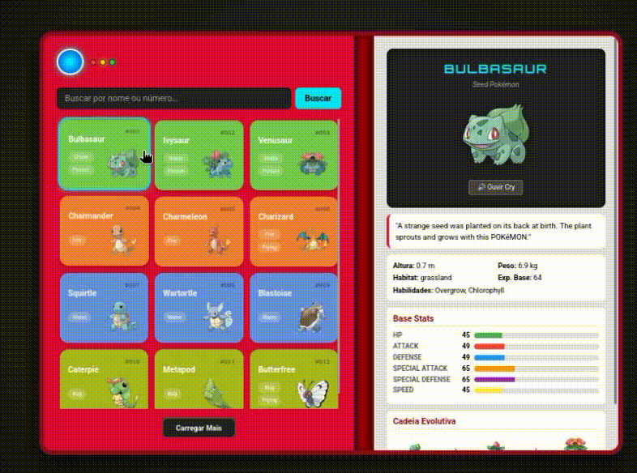

# ⚡ Pokédex App

Uma aplicação interativa desenvolvida em **JavaScript Vanilla** para listar e buscar informações em tempo real consumindo dados da API oficial de Pokémon.

---

## 📱 Demonstração em Vídeo



---

## 🚀 Tecnologias e Conceitos Aplicados

O projeto foi construído focando nos fundamentos da Web moderna e manipulação nativa do navegador:

* **HTML5 & CSS3** - Estruturação semântica da interface e estilização responsiva personalizada.
* **Fetch API** - Utilizada para realizar requisições assíncronas assentes na arquitetura REST para consumir dados dinâmicos.
    * [Documentação Oficial da Fetch API (MDN)](https://developer.mozilla.org/en-US/docs/Web/API/Fetch_API/Using_Fetch)
* **Arrow Functions (ES6+)** - Implementadas para otimizar o escopo do código, tornando a sintaxe das funções anônimas e dos loops (`.map`, `.forEach`) muito mais limpa e menos verbosa.
    * [Guia de Arrow Functions (W3Schools)](https://www.w3schools.com/js/js_arrow_function.asp)
* **Manipulação de DOM** - Renderização dinâmica dos cards e barras de status sem a necessidade de frameworks externos.

---

## 🛠️ Como Executar o Projeto

Se quiser rodar este projeto localmente no seu ambiente:

1. Clone este repositório:
   ```bash
   git clone [https://github.com/Beerus15/pockedex.git](https://github.com/Beerus15/pockedex.git)
